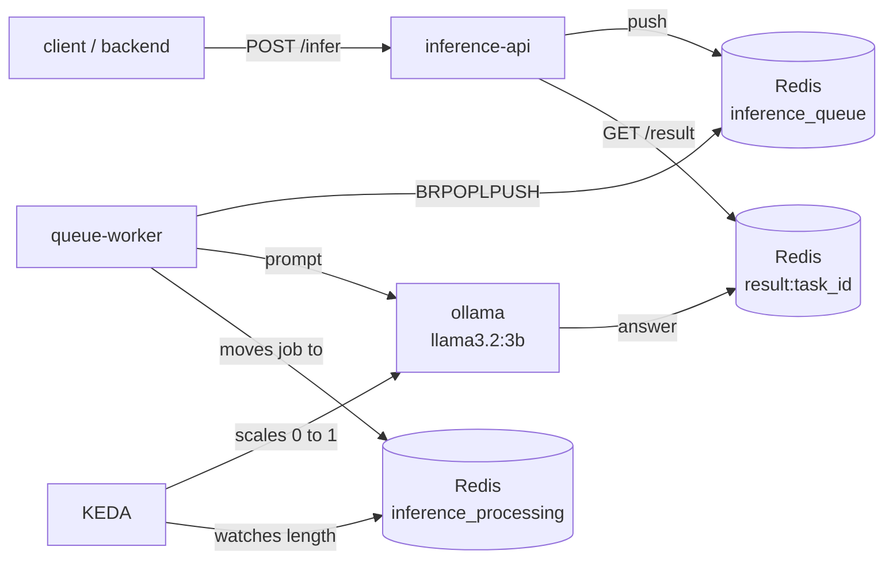

<div align="center">

# Enterprise-Grade GKE Platform


</div>

A production-grade cloud platform built on Google Kubernetes Engine. It implements the operations an enterprise platform team runs on a private multi-zone cluster: eBPF networking with encrypted pod traffic, a WAF-protected edge, highly available PostgreSQL, enterprise observability, chaos engineering, and an inference server that scales to zero when idle. Everything runs inside a GCP free-trial budget, so the cost engineering is part of the design.

> The complete walkthrough and build is documented as an 11-part blog series (links in the [Blog Series](#blog-series) section).

## Table of Contents

- [Why This Exists](#why-this-exists)
- [Who It Is For](#who-it-is-for)
- [Tech Stack](#tech-stack)
- [Request Flow](#request-flow)
- [Architecture](#architecture)
- [Security (Defense in Depth)](#security-defense-in-depth)
- [Autoscaling](#autoscaling)
- [Observability](#observability)
- [What's Implemented](#whats-implemented)
- [Directory Structure](#directory-structure)
- [Deployment](#deployment)
- [Blog Series](#blog-series)
- [Known Limitations](#known-limitations)

## Why This Exists

Most DevOps portfolios stop at deploying a standalone and isolated app on Kubernetes without a sense of how that app interacts and plugs into other elements of an enterprise-level system. In this project, I demonstrated and simulated what a Senior Infrastructure or DevOps Engineer would handle beginning from Day 2 of their operation, covering everything from security, reliability, observability, and cost engineering; the four pillars of a production infrastructure.

The entire project is built, documented, and torn down inside the walls of a $300 GCP free trial, which is a sufficient canvas to draw our robust infrastructure upon, and also informs some infrastructural decisions.

## 👤 Who It Is For

- **Platform and DevOps engineers**: a reference architecture for a storefront plus a stateful database plus an event-driven AI workload on one cluster, with every manifest versioned.
- **Early DevOps Enthusiast**: the same build as an 11-part hands-on series, so each part can be followed and verified on your own trial account.
- **Rebuilders**: anyone with a GCP trial, a domain, and the scripts in this repo can stand the whole thing up in an afternoon.

## Tech Stack

The platform is assembled from these pieces, each chosen for a specific production job:

- **GKE** (private, multi-zone, spot nodes) and **Terraform** for all infrastructure as code, with state in GCS.
- **Cilium** for the eBPF datapath, **WireGuard** for node-to-node encryption, and **Hubble** for flow visibility.
- **Envoy Gateway** (Gateway API) with the **Coraza** Web Application Firewall running the **OWASP Core Rule Set** inside the proxy process.
- **CloudNativePG** for a 3-replica **PostgreSQL 16.4** cluster with synchronous replication and GCS backups.
- **Redis**, a Flask API, a queue worker, **Ollama** (llama3.2:3b), and **KEDA** for the async, scale-to-zero inference subsystem.
- **Prometheus**, **Grafana**, **Alertmanager**, and the **Datadog** agent for observability.
- **Chaos Mesh** for fault injection against live infrastructure.
- **Cloud Functions + Pub/Sub** for the budget kill switch.

## Request Flow

What happens when a request reaches the storefront:

1. **Cloudflare**: proxied DNS for `boutique.invincibledevops.tech`, TLS termination, and bot filtering in front of the origin.
2. **GKE Load Balancer**: the single public entry point, one external IP owned by the cluster.
3. **Envoy Gateway**: Gateway API routing at the edge, listening on ports 80 and 443.
4. **Coraza WAF**: the OWASP Core Rule Set evaluates every request inside the Envoy process; attack payloads answer 403 before they reach any application code.
5. **HTTPRoute**: routes the hostname to the storefront's frontend Service.
6. **Online Boutique services**: catalog, cart, recommendation, and shipping workloads, with state persisted in CloudNativePG.
7. **Metrics**: every hop above emits metrics to Prometheus and Datadog, so the path is observable end to end.

The inference subsystem has its own flow (submit, queue, process, poll) and is described in the [Autoscaling](#autoscaling) section.

## Architecture

### High Level Architecture


### Infrastructure

- **Region**: `us-central1`, three zones, cluster `devops-portfolio` in project `devops-portfolio-prod`.
- **IaC**: Terraform with remote state in `gs://devops-portfolio-tfstate`; the cluster, VPC, Cloud NAT, and node pools are defined in `infra/terraform/`.
- **Cluster**: private and multi-zone; the control plane has a private endpoint, nodes have no public IPs, and egress goes through Cloud NAT.
- **Node pools**: 3 system + 3 application spot nodes, one per zone, in the `e2` family; the application pool autoscales between 1 and 3 nodes per zone; the platform uses about half of the regional quota (6 of 12 vCPUs, 6 of 8 instances).
- **Networking**: Cilium replaces the kube-proxy datapath with eBPF and encrypts all node-to-node pod traffic with WireGuard, proven with an on-wire capture.

### Application Services

- **Edge**: Envoy Gateway v1.8.3 with the Coraza dynamic module loaded into the proxy process, plus the five Gateway API manifests in `kubernetes/gateway/`.
- **Storefront**: Google Online Boutique (upstream microservices-demo manifests) behind the WAF.
- **Database**: CloudNativePG cluster `ha-postgres`, 3 instances, PostgreSQL 16.4, synchronous replication (the leader waits for a replica ack before confirming a commit), in-place storage growth, and GCS backups.
- **Inference**: an async queue API (Redis, Flask API, queue worker) serving llama3.2:3b through Ollama, scaled by KEDA; only reachable inside the cluster via port-forward.
- **Observability agents**: kube-prometheus-stack, the Datadog agent, and Hubble, all watching the same workloads.
- **Kill switch**: a gen2 Cloud Function that stops every instance in the cluster zones when the budget alert fires.

## Security (Defense in Depth)

Security is layered, and each layer assumes the one above it may have failed:

1. **Private cluster**: nodes without public IPs, a private control plane, Cloud NAT for egress; there is no route from the internet to a node.
2. **Identity and org policy**: every authenticated step uses service account impersonation with short-lived tokens.
3. **RBAC**: a dedicated cluster management service account with a scoped ClusterRole binding, so tooling runs with least privilege (`kubernetes/rbac.yaml`).
4. **Network encryption**: Cilium WireGuard encrypts every node-to-node packet transparently; verified by capturing traffic on the wire; application traffic stays unreadable even from a compromised host.
5. **Edge filtering**: one LoadBalancer IP in front, Envoy Gateway routing, and the Coraza WAF with the OWASP CRS in the proxy process; `waf-test.sh` blocks 5 of 5 attack classes and a full OWASP ZAP scan is part of the pipeline; attacks die at the edge before any service code runs.
6. **Cloudflare**: proxied DNS hides the origin IP and terminates TLS; the origin runs plain HTTP behind the proxy (Flexible mode), which is an honest trade-off on this trial cluster.
7. **Repository hygiene**: `.gitignore` excludes Terraform state, service account keys, and credentials; nothing secret has ever been committed to this repository.
8. **Budget kill switch**: a gen2 Cloud Function triggered by the Pub/Sub budget alert stops every instance at 95% of the budget.

## Autoscaling

The autoscaling design is the part most portfolios skip: scale down to nothing, not just scale up on load.

- **KEDA scale-to-zero**: the `ollama` Deployment runs at `minReplicaCount: 0` and `maxReplicaCount: 1`; when the Redis queue is empty, the model pod is terminated and idle cost drops to zero.
- **Scale on the processing list**: KEDA watches `inference_processing`, not the raw queue. The raw queue empties the moment the worker pops a job, even while the model is still generating; the processing list holds the job until the answer is stored, so the model can never scale down mid-generation. `cooldownPeriod: 60`, `pollingInterval: 10`.
- **Cold start is a design input**: the worker retries the model for up to 8 minutes with capped backoff (20 attempts, wait capped at 30 seconds), which covers pod start plus model load; jobs are requeued on give-up, never dropped.
- **One replica by design**: the model disk is ReadWriteOnce, so a shared model store would be required to scale out; the queue makes one replica sufficient anyway.
- **Node-level autoscaling**: the GKE cluster autoscaler grows the application pool between 1 and 3 nodes per zone, and spot VMs mean preemption is a tested failure mode, not an incident.



## Observability

Three layers watch the same cluster, each from a different angle:

- **Prometheus, Grafana, Alertmanager**: `kube-prometheus-stack` installs the operator, Prometheus, Grafana, Alertmanager, and the node exporters in one chart.
- **Datadog**: the agent runs on every node plus a cluster agent with the metrics provider; APM, logs (`containerCollectAll`), and the process agent are enabled, site `us5.datadoghq.com`.
- **Hubble**: Cilium's service map and flow logs straight from the eBPF datapath.

## What's Implemented

- A private, multi-zone GKE cluster defined entirely in Terraform, state in GCS.
- Cilium with WireGuard node-to-node encryption, proven on the wire.
- An Envoy Gateway edge with the Coraza WAF and OWASP CRS; 5 of 5 attack classes blocked and a full OWASP ZAP scan.
- Online Boutique behind the WAF on `boutique.invincibledevops.tech`.
- A CloudNativePG PostgreSQL 16.4 cluster with synchronous replication and automated failover, proven under load with zero committed writes lost.
- kube-prometheus-stack with cross-namespace monitoring and Grafana dashboards.
- Datadog agent + cluster agent with APM, logs, and the metrics provider.
- Four Chaos Mesh experiments with steady-state validation, plus a node drain drill.
- A KEDA scale-to-zero inference server with an async submit-and-poll API.
- A budget kill switch Cloud Function wired to the billing alert.
- An 11-part blog series documenting the entire build.

### Required Repository Secrets

| Secret | Description |
|---|---|
| `GCP_PROJECT_ID` | The GCP project everything lives in, `devops-portfolio-prod`; set in `infra/terraform/terraform.tfvars` (project IDs are not secrets, and this file is tracked) |
| `DD_API_KEY` | Datadog agent authentication; passed as an environment variable at helm install time, never written into manifests |
| `CLOUDFLARE_API_TOKEN` | DNS record updates for `boutique.invincibledevops.tech`; used interactively |

## Directory Structure

```
.
├── chaos/                          
│   ├── cpu-stress-ai.yaml          
│   ├── network-delay-db.yaml       
│   ├── node-drain.sh               
│   ├── pod-kill-app.yaml           
│   └── steady-state-check.yaml       
├── functions/
│   └── budget-kill-switch/         
│       ├── main.py
│       └── requirements.txt
├── infra/
│   └── terraform/                  
│       ├── backend.hcl             
│       ├── main.tf                 
│       ├── outputs.tf
│       ├── terraform.tfvars        
│       └── variables.tf
├── kubernetes/
│   ├── ai/                         
│   ├── boutique/                   
│   ├── cilium/                     
│   ├── cnpg/                       
│   ├── envoy/                      
│   ├── gateway/                    
│   ├── legacy/                    
│   └── rbac.yaml                   
├── scripts/
│   ├── ai-demo-reset.sh            
│   ├── deploy-boutique.sh          
│   ├── install-cilium.sh           
│   ├── install-envoy-gateway.sh    
│   ├── phase1-deploy.sh            
│   ├── test-failover.sh           
│   ├── waf-test.sh                
│   ├── zap-scan.sh                 
│   └── legacy/                   
├── .gitignore
└── README.md
```

## Deployment

### Prerequisites & Configuration

Before building, you need: `gcloud`, `kubectl`, `helm`, `terraform`, and the Cilium CLI installed; a Cloudflare account with a domain; a GCP organization identity (Cloud Identity) with a project and a billing account; and the state bucket created (`gcloud storage buckets create gs://devops-portfolio-tfstate/ --uniform-bucket-level-access`).

#### 1. GCP Project ID

Replace all instances of `devops-portfolio-prod` with your project ID in the following files:

- `infra/terraform/terraform.tfvars` (Line 1)


(The terraform directory also needs `backend.hcl` if your state bucket name differs.)

#### 2. Domain Name

Replace all instances of `boutique.invincibledevops.tech` with your domain in the following files:

- `kubernetes/gateway/httproute.yaml`

Then create a proxied A record at Cloudflare pointing at the Load Balancer IP printed by `scripts/install-envoy-gateway.sh`, with SSL mode set to Flexible. `scripts/deploy-boutique.sh` applies the route with `BOUTIQUE_HOST=<your-domain> ./scripts/deploy-boutique.sh`.

#### 3. GCP Service Accounts

The Terraform service account is `terraform-sa@devops-portfolio-prod.iam.gserviceaccount.com`. It is granted the roles it needs in Part-2 of this project, and every terraform command authenticates through impersonation, which needs no key:

```bash
gcloud auth application-default login \
  --impersonate-service-account=terraform-sa@devops-portfolio-prod.iam.gserviceaccount.com
```


### Build Checklist

The single ordered checklist for building the environment end to end. 

```bash
# 1. Infrastructure: private multi-zone cluster, VPC, Cloud NAT, node pools

cd infra/terraform
terraform init -backend-config=backend.hcl
terraform apply -var-file=terraform.tfvars
gcloud container clusters get-credentials devops-portfolio --region us-central1 --project devops-portfolio-prod

# 2. Cilium with WireGuard (values carry the verified fixes for this cluster)

./scripts/install-cilium.sh
cilium status        # expect: Encryption: Wireguard
kubectl apply -f kubernetes/cilium/encryption-test.yaml  

# 3. Envoy Gateway v1.8.3 + the five gateway manifests

./scripts/install-envoy-gateway.sh   

# 4. Online Boutique behind the WAF

BOUTIQUE_HOST=boutique.invincibledevops.tech ./scripts/deploy-boutique.sh

# 5. Verification: the WAF must block, the storefront must serve

./scripts/waf-test.sh              
./scripts/zap-scan.sh               \

# 6. CloudNativePG operator + the HA cluster (3 instances, PostgreSQL 16.4)

kubectl apply -f https://raw.githubusercontent.com/cloudnative-pg/cloudnative-pg/release-1.24/releases/cnpg-1.24.0.yaml
kubectl apply -f kubernetes/cnpg/postgres-cluster.yaml
./scripts/test-failover.sh           

# 7. Observability: Prometheus, Grafana, Alertmanager, node exporters

helm repo add prometheus-community https://prometheus-community.github.io/helm-charts
helm repo update
helm upgrade --install monitoring prometheus-community/kube-prometheus-stack \
  --namespace monitoring --create-namespace

# 8. Datadog agent + cluster agent (optional but part of the series)

helm repo add datadog https://helm.datadoghq.com
helm upgrade --install datadog datadog/datadog \
  --namespace datadog --create-namespace \
  --set datadog.apiKey="$DD_API_KEY" \
  --set datadog.site="us5.datadoghq.com" \
  --set datadog.apm.enabled=true \
  --set datadog.logs.enabled=true \
  --set datadog.logs.containerCollectAll=true \
  --set datadog.processAgent.enabled=true \
  --set datadog.clusterAgent.enabled=true \
  --set datadog.clusterAgent.metricsProvider.enabled=true

# 9. AI inference with scale to zero

kubectl create namespace ai-inference
kubectl apply -f kubernetes/ai/
helm repo add kedacore https://kedacore.github.io/charts
helm repo update
helm install keda kedacore/keda --namespace keda --create-namespace
kubectl apply -f kubernetes/ai/scaledobject.yaml

# 10. Chaos Mesh + experiments against live infrastructure

helm repo add chaos-mesh https://charts.chaos-mesh.org
helm upgrade --install chaos-mesh chaos-mesh/chaos-mesh --namespace chaos-mesh --create-namespace
kubectl apply -f chaos/pod-kill-app.yaml
kubectl apply -f chaos/network-delay-db.yaml
kubectl apply -f chaos/cpu-stress-ai.yaml
./chaos/node-drain.sh             
kubectl apply -f chaos/steady-state-check.yaml

# 11. Budget kill switch (Pub/Sub topic must exist before deploy)

gcloud pubsub topics create budget-alerts
gcloud functions deploy budget-kill-switch \
  --runtime python312 \
  --trigger-topic budget-alerts \
  --set-env-vars GCP_PROJECT=devops-portfolio-prod \
  --source functions/budget-kill-switch \
  --region us-central1 \
  --gen2 \
  --entry-point kill_switch
```

**NB**: `terraform-key.json`, `DD_API_KEY`, and the Cloudflare token never enter this repository. `.gitignore` enforces it, and the emergency key should be rotated if it ever leaves the author's machine.

### Verification

| Check | Command | Expected |
|---|---|---|
| WAF | `./scripts/waf-test.sh` | 5/5 attack classes answered 403 |
| Networking | `cilium status` | `Encryption: Wireguard [OK]` |
| Database | `./scripts/test-failover.sh` | failover under load, zero committed writes lost |
| AI | `./scripts/ai-demo-reset.sh`, then submit jobs | queue empties, `ollama` back to 0/0 after 60 s |
| Availability | `kubectl apply -f chaos/steady-state-check.yaml` | availability above target during experiments |

## Blog Series

The project is documented as a hands-on engineering series, one post per part of the build.

| # | Title | Medium link |
|---|---|---|
| 1 | Building an Enterprise-Grade Kubernetes Ecosystem on GKE | _[Part-1](https://medium.com/@theinvincibledev/building-an-enterprise-grade-kubernetes-ecosystem-on-gke-d52102d912a7?sharedUserId=theinvincibledev)_ |
| 2 | Setting Up Your Environment, Prerequisites, and Cost Optimization | _[Part-2](https://medium.com/@theinvincibledev/part-2-setting-up-your-environment-prerequisites-and-cost-optimization-64d3c4b9bbf7)_ |
| 3 | Provisioning a Private, Multi-Zone GKE Cluster with Terraform | _[Part-3](https://medium.com/@theinvincibledev/part-3-provisioning-a-private-multi-zone-gke-cluster-with-terraform-d1499ece7177)_ |
| 4 | Deploying Cilium: eBPF Networking, WireGuard Encryption, and Hubble Observability. | _[Part-4](https://medium.com/@theinvincibledev/part-4-deploying-cilium-ebpf-networking-wireguard-encryption-and-hubble-observability-360a9bec2dab)_ |
| 5 | Configuring the Cluster's Edge: Envoy Gateway with an In-Process Coraza WAF & Deploying a Microservices Application Behind the Web Application Firewall. | _[Part-5](https://medium.com/@theinvincibledev/part-5-configuring-the-clusters-edge-envoy-gateway-with-an-in-process-coraza-waf-deploying-a-5797dd62b092)_ |
| 6 | Deploying a Highly Available PostgreSQL on Kubernetes with CloudNativePG, Load Testing It and Proving Failover Mechanism | _[Part-6](https://medium.com/@theinvincibledev/part-6-deploying-a-highly-available-postgresql-on-kubernetes-with-cloudnativepg-load-testing-it-92b64a304393)_ |
| 7 | Observability with Prometheus, & Grafana | _[Part-7](https://medium.com/@theinvincibledev/part-7-observability-with-prometheus-grafana-b5159196d598)_ |
| 8 | Observability with Datadog | _[Part-8](https://medium.com/@theinvincibledev/part-8-optional-observability-with-datadog-e8562102988e)_ |
| 9 | Chaos Engineering with Chaos Mesh | _[Part-9](https://medium.com/@theinvincibledev/part-9-chaos-engineering-with-chaos-mesh-80956e7f4236)_ |
| 10 | [Part 10] Deploying an Ollama Inference Server on GKE with KEDA | _[Part-10](https://medium.com/@theinvincibledev/part-10-deploying-an-ollama-inference-server-on-gke-with-keda-7c89a4081461)_ |
| 11 | [Part 11] Project Wrap-Up: What We Built, the Full Teardown, and the Portfolio Value | _paste link here_ |

## ⚠️ Known Limitations

- **Hardware**: 6 spot nodes, no GPUs, and the application pool runs in the `e2` family. The model server runs llama3.2:3b on CPU at 2 to 5 tokens per second, one prompt at a time.
- **Scale**: the AI deployment is capped at 1 replica by the ReadWriteOnce model disk; scaling out would need a shared model store.
- **Spot churn**: nodes are preemptible; the cluster absorbs it (the node drain experiment proves it), but pod restarts are expected behavior.
- **Origin TLS**: Cloudflare terminates TLS and the origin runs plain HTTP behind the proxy (Flexible mode); the WAF still sees every request at the gateway.
