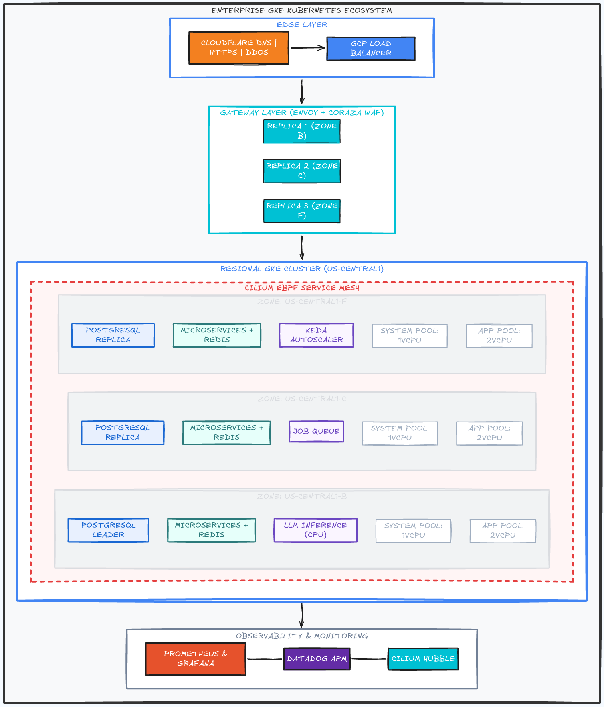

# Building an Enterprise-Grade Kubernetes Ecosystem on GKE

*A hands-on engineering series featuring Cilium, Envoy Gateway, and Chaos Mesh.*

---

## First things first: why this project?

Curious how different tools come together into one resilient system-beyond deploying an isolated app to the cloud, beyond spinning up a few pods? Then be my guest. 

This is a hands-on series where I build a resilient, highly available, and secure Kubernetes environment on GKE, from a blank GCP account to a live, WAF-protected website on a 3-AZ cluster.

This post is the first of an **11-part series**, where I walk you through the whole build; step by step, every command, every decision. Each phase builds on the previous one, and together they culminate in a single, cohesive architecture that demonstrates **security, reliability, observability, and cost-awareness**— the four pillars of production infrastructure.

I had a lot of fun building this, and I learned even more. I can't wait to pour it all out here and bring you into the fun.

---

## What's in it for you (and me)?

Finish this project end to end, and you walk away with serious, senior-level insight into what an enterprise-grade ecosystem actually looks like, and you'll be in the know about some amazing tools and technologies in the cloud ecosystem. The complete project is gold for your DevOps portfolio and gives you a strong talking point in interviews.

You will also learn the following:

### Infrastructure as Code & GitOps
- Terraform for provisioning GKE clusters, node pools, and networking
- Helm for packaging and deploying complex workloads

### Kubernetes Deep Knowledge
- The operator pattern (CloudNativePG, KEDA)
- Custom Resource Definitions (CRDs) and controllers
- Pod Disruption Budgets, affinity/anti-affinity, topology spread constraints
- Horizontal Pod Autoscaling (HPA) vs. event-driven autoscaling (KEDA)
- Spot VM node pools and graceful termination handling

### Networking & Security
- Cilium CNI with eBPF — replacing kube-proxy entirely
- Transparent WireGuard encryption between pods
- Gateway API (GatewayClass/Gateway/HTTPRoute) on Envoy Gateway
- A Web Application Firewall (Coraza) with the OWASP Core Rule Set, running
  in-process as a native Envoy dynamic module
- NetworkPolicy and CiliumNetworkPolicy for microsegmentation

### Observability & Chaos Engineering
- Prometheus + Grafana for metrics collection and visualization
- Datadog integration for enterprise-grade APM and infrastructure monitoring
- Chaos Mesh for injecting faults: pod kills, network latency, CPU stress, node failures
- Defining and validating steady-state hypotheses

### AI Infrastructure
- Deploying LLM inference on CPU (Ollama)
- KEDA event-driven autoscaling — a Redis queue-length scaler driving scale-to-zero
- Model preloading and cold-start optimization on spot instances

### Real-World Enterprise Practices
- Google Cloud Organization hierarchy, IAM, and service accounts
- Cloudflare DNS management with free HTTPS proxying
- Cost optimization with spot VMs and scale-to-zero patterns
- Clean project isolation for budget control

---

## The constraints around this project

This project runs on a **GCP free-trial account**: 90 days and $300 of credit, with no way to lift the default quotas. These are the constraints Google applies to free-trial accounts — you can't request a quota increase, GPUs are never granted, and the numbers below are the walls you build within.

- **`INSTANCES`** (us-central1): 8
- **`CPUS_ALL_REGIONS`** (global): 12
- **`IN_USE_ADDRESSES`** (us-central1): 4
- **`SSD_TOTAL_GB`** (us-central1): 250
- **Quota increases**: not available on trial
- **GPUs**: not attachable on trial

To stay within these constraints, the final sizing of our resources will be:

- System pool: 3 × `e2-custom-1-4096` (1 vCPU / 4 GB), one per zone → 3 vCPU
- Application pool: `e2-custom-2-8192` (2 vCPU / 8 GB), autoscaling min 1 / max 3 → up to 6 vCPU
- All nodes: spot, `pd-standard` 30 GB disks, private (no external IPs)
- Totals: 9 vCPU of 12 used at max scale, 6 of 8 instances, 2 of 4 addresses (NAT + LoadBalancer)

---

## The caveat (read this before you start)

Building this end to end takes time. If you're the busy type, budget weeks; if you're a student with room to stretch, days. Either way, here's the honest warning: **don't expect to tear your infra down once you begin.** It's built to stay up — and that sounds expensive, right?

Relax. We're running on spot instances and a generous $300 of GCP credits.

Can I shock you? My full environment — 6 nodes (3 system + 3 app at max scale), 90+ pods, 200+ containers, and live AI inference — stayed up for **two weeks on less than $20**. So?

**Let's get to it.**

---

Next in the series: Setting Up Your Environment, Prerequisites, and Cost Optimization
